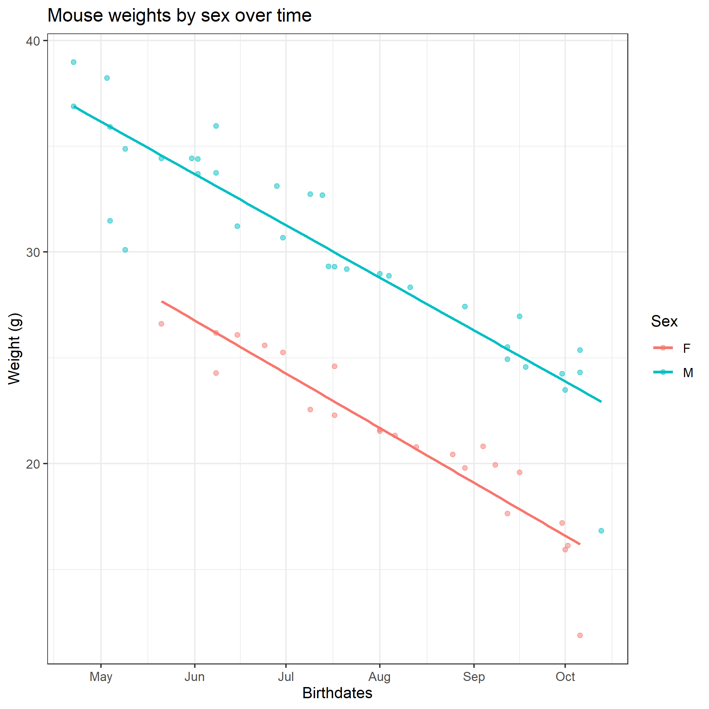

# DVAC_Nov_2020_intro_R_and_ggplot
This repository contains all of the information, code, and materials for the "Intro to R, basic data manipulation, and plotting using ggplot2" workshop hosted by Emory's Data Visualization and Analysis Committee

Authors: 
- Austin Nuckols (tnukols@emory.edu)
- Jessica Hoffman (jrhoff3@emory.edu)

## **How to use:**

You can use the slides in slides/ to get acquainted with R and some of its functions. Otherwise, use the documents in code_keys/ to see how to read, manipulate/munge, and graph different instances of biological data. We worked to cover a broad spectrum of examples from simple comparative stuff to dose-response curves to PCA's, volcano plots, heatmaps, etc. Check out the additional_resources/ folder for more resources pertaining to foundations in R, biostatistics, cheatsheets, or more advanced plotting. The additional_resources/extra/ subfolder is a larger 'dump' of resources that may be useful.

The goal is to take a novice R user and boost you straight to manipulating your data and making sharp looking graphs like this:

## Folder contents

The slides/ folder contains the .html ioslides file as well as the .Rmd file used to make these slides. This is some introductory notes about R and a demonstration of the features.

The Live_session_Part*.Rmd files show the code written during the live session and represent any changes we made during it. These should be complementary to the files found in code_keys/. 

The files in code_keys/ are more comprehensive and include multiple examples of munging and plotting biological data. Additionally, the script used to generate the mice data is there.

results/ shows some example graphs that were saved from a code key or from a live session document.

data/ contains all of the example data.

planning/ contains notes that were used by the authors when developing the workshop. These can be ignored.

additional_resources/ contains links, docs, etc. that are useful supplemental materials.
