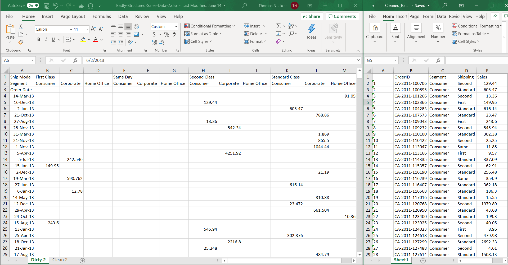

To view this document in slide format, choose knit above!

## Goals for this workshop {.build .smaller}

- To give a brief introduction to R and explain why you should use it

- To prepare you directly to use R with real biological data

   - Load data and perform simple data manipulations

   - Create high quality custom plots

   - Bonus: write scripts that automate these two processes
      - Builds off of the previous DVAC workshop "Terminal Commands and Bash Scripts"

- To establish a foundation from which you can continue to learn R


- There will be resources included on the Github page (https://github.com/taustinn11/DVAC_Nov_2020_intro_R_and_ggplot)

## What is R? What does R do?{.build}

- R is an object-oriented programming language developed by statisticians Ross Ihaka and Robert Gentleman (https://www.r-project.org/about.html)
  - Robert Gentleman is also the originator of the Bioconductor Project (Gentleman et al. 2004)
  - R is used heavily in the academic community (particularly in biology) as well in industry settings (see https://github.com/ThinkR-open/companies-using-r)

- R has a TON of applications beyond biostatistics and biological data visualization 
  - Scraping web data & interacting with databases/APIs
  - Building apps, reports, and other software products
  - Plotting of different kinds of data in a variety of ways 
  - Developing machine learning models
  
## Why should I use R (or any programming language)? {.smaller}

- **Reproducibility and Efficiency**
  - Every step *should be* recorded in your script ensuring analysis documentation and reproducibility
  - A well-written script is reusable 
    - Less time doing "prep analysis" work and more time considering the results
- Scalability and Extensibility
  - R can handle all kinds of data (images, text, tabular, unstructured) and all sizes of data
  - R has over 10,000 packages for different statistical, plotting, mapping, and software development applications
- Free, open source, and **high quality**
  - Free & Open Source = Huge R community = support and rigor
  - **Publication quality plots**
    - Fun fact: BBC News uses R for static plots <font size="2"> (source: https://medium.com/bbc-visual-and-data-journalism/how-the-bbc-visual-and-data-journalism-team-works-with-graphics-in-r-ed0b35693535) </font>

```{r echo=F, message=FALSE, warning=FALSE}
suppressMessages(library(tidyverse))
suppressMessages(library(knitr))
```

```{r include=FALSE}
# Data in two numeric vectors
women_weight <- c(38.9, 61.2, 73.3, 21.8, 63.4, 64.6, 48.4, 48.8, 48.5)
men_weight <- c(67.8, 60, 63.4, 76, 89.4, 73.3, 67.3, 61.3, 62.4) 
# Create a data frame
weight_data <- data.frame( 
                group = rep(c("Woman", "Man"), each = 9),
                weight = c(women_weight,  men_weight)
                )
```

## A short demonstration {.build}

Simple calculations

```{r echo= TRUE}
2+2
6^6
mean(c(6, 9, 10, 15, 8, 3, 6))
```

## A short demonstration {.build .smaller}

Stores data for viewing, manipulating, and performing statistical tests on

```{r echo = TRUE, out.height=4}
slice(.data = weight_data, 8:11) #showing a small slice of my weight data
t.test(weight~group, weight_data)
```

## A short demonstration {.build .smaller}

For plotting

```{r fig.height=4, fig.width=6, fig.align='center'}
ggplot(weight_data, aes(x = group, y = weight))+
  geom_boxplot()+geom_point()+theme_bw()+
  ggtitle("My Made Up Weight Data")
```

## Scope of this workshop {.smaller}

- We are going to focus on reading data, modifying data, and plotting data
- Importantly, there are too many considerations to discuss when selecting a statistical test to cover today
  - Statistics will be a future workshop topic 
  - You can message DVAC for statistics advice if you have a specific case or question (regardless of whether you are using R or not)
- We are going to bypass several key fundamentals of R programming
  - This is a calculated decision to get you straight to working with **your data** and plotting **your data** without spending time on features you may not need necessarily
  - If you want to continue learning R, checkout the Github page (https://github.com/taustinn11/DVAC_Nov_2020_intro_R_and_ggplot)
    - Start with immediate files and links in the additional_resources/ folder  
    - Follow this with the stuff in additional_resources/extra/

## What does object-oriented mean?{.build .smaller}

- In R, data are stored as 'objects' and have 'data types'
  - 'Data types' are the kind of value a data point is
    - Age (e.g. 26) is "numeric" while Name (e.g. "Austin") is of type "character"
  - An 'object' is data that is organized into a structure and assigned a name
    - A single value (which is considered a vector of size 1), a vector of values, a 2D table (data frame or a matrix), a list, etc. The data in an object can be of any type.
    - I could combine the Age and Name variables into a data frame and name it zoom_meeting_table

```{r}
Age <- c(26, 24, 26)
Name <- c("Austin", "Jess", "Logan")
zoom_meeting_table <- data.frame(Name, Age)
zoom_meeting_table
```


## What are the data objects in R {.build .smaller}

{width=80%}
    
- We are going to primarily use **data frames and vectors**
  - This represents 'tabular' data aka data in table form
  - It is most similar to what you would organize in Microsoft Excel

```{r}
class(weight_data)
class(weight_data$group);class(weight_data$weight)
```

## A Quick Note about Tidy Data

- Briefly, tidy data is a principle by which you try to record your data and keep it in "tidy" format
  - Being tidy means that each variable has it's own column and isn't spread unnecessarily
    - https://vita.had.co.nz/papers/tidy-data.pdf
  - This workshop is going to operate under the assumption that **you will put in tidy data**. You can clean untidy data, but to do so is beyond the scope of this workshop
  - I've included an example of what untidy vs tidy data looks like:

## Tidy Data Example

{width=100%}

---

Let's start the live coding demo!

## Citations

Some citations in text

Gentleman, R. C., Carey, V. J., Bates, D. M., Bolstad, B., Dettling, M., Dudoit, S., Ellis, B., Gautier, L., Ge, Y., Gentry, J., Hornik, K., Hothorn, T., Huber, W., Iacus, S., Irizarry, R., Leisch, F., Li, C., Maechler, M., Rossini, A. J., Sawitzki, G., … Zhang, J. (2004). Bioconductor: open software development for computational biology and bioinformatics. Genome biology, 5(10), R80. https://doi.org/10.1186/gb-2004-5-10-r80
